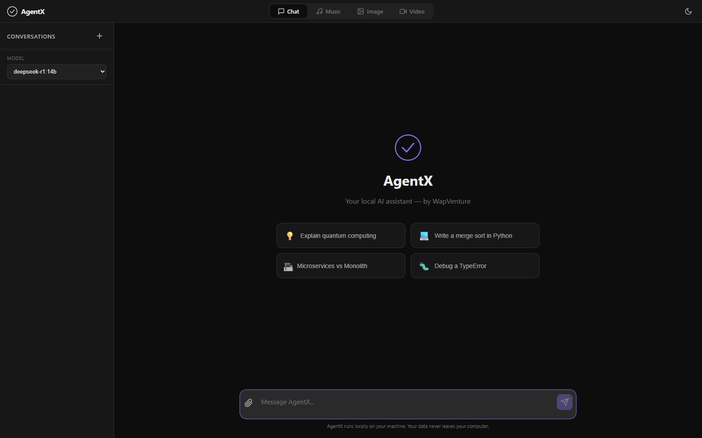
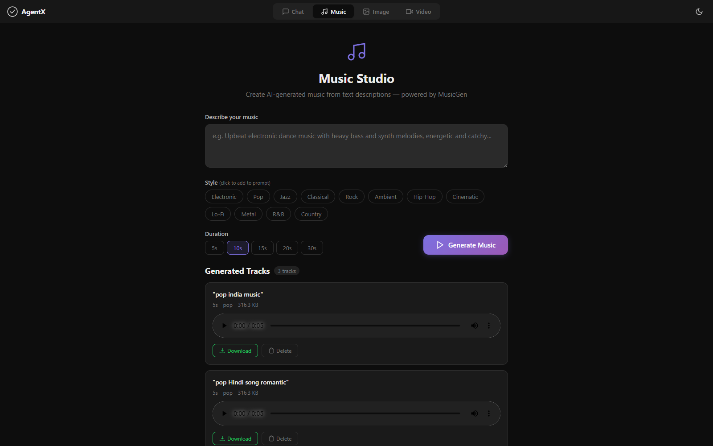
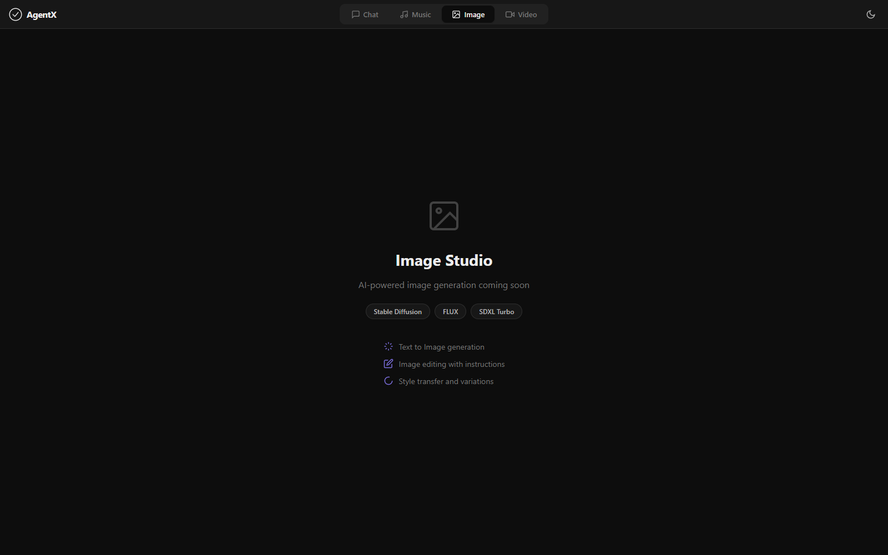
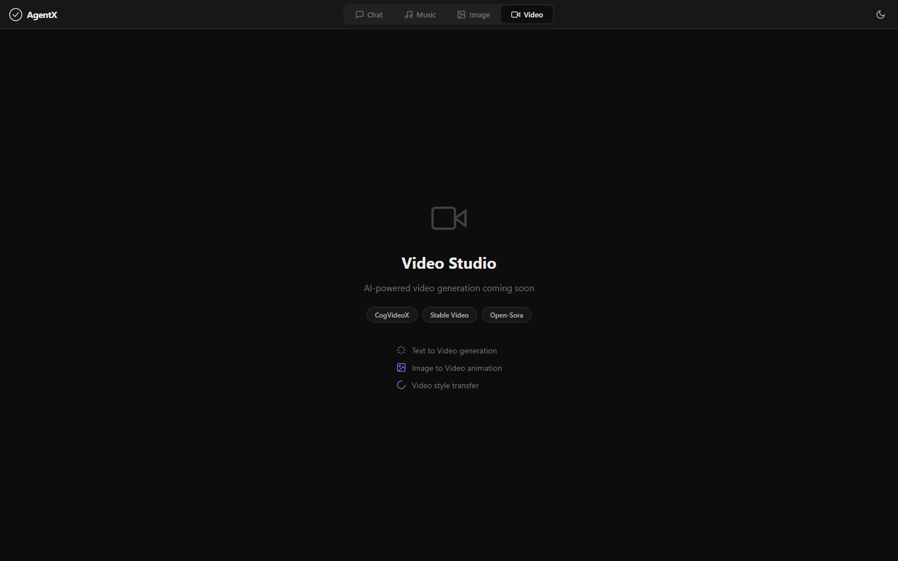

# JobHuntX (An AI Creative Suite)

**The Offline LLM + Creative Suite (100% Local, 100% Free)**

JobHuntX is a local AI desktop/web app by **WapVenture**.
It gives you a private, offline AI workspace for chatting with local LLMs, generating music from text prompts, and managing future image/video workflows from one interface.
It runs directly on your PC with no cloud dependency for chat and no subscription fees.

## What This Software Does

JobHuntX lets you use AI tools on your own computer instead of relying on a cloud service. In the current build, you can:

- chat with a local Ollama model
- attach files and images to conversations
- generate music locally with MusicGen
- manage creative work from Chat and Music today, with Image Studio and Video Studio included as future-facing tabs



## Why JobHuntX

- Runs locally on your computer (privacy-first workflow)
- No monthly subscription required
- Multi-tab AI workspace: **Chat**, **Music**, **Image Studio**, **Video Studio**
- Built for speed, control, and everyday productivity

## Model Modes for Chat

JobHuntX supports multiple local Ollama models and groups them into practical usage tiers:

| Mode | Best For | Typical Examples |
|---|---|---|
| **Fast** | Quick replies, lightweight tasks, everyday Q&A | `llama3.2:1b`, `llama3.2:3b`, `phi3:mini` |
| **Balanced** | General-purpose coding, writing, research | `qwen2.5:7b`, `mistral:7b`, `gemma2:9b` |
| **Experienced** | Deeper reasoning, longer and complex prompts | `deepseek-r1:14b`, `deepseek-r1:32b` |

## What You Can Do

### 1) Offline AI Chat

- Streamed responses with conversation history
- File and image attachments in chat
- Code-friendly markdown rendering
- Local conversation storage

### 2) Music Generation

- Text-to-music generation using MusicGen
- Style presets and duration controls
- Tracks saved locally on your machine
- In-app playback and track management

### 3) Image Studio

- Included in the UI for image workflows
- Designed for local text-to-image pipelines
- Current build status: **Coming Soon**

### 4) Video Studio

- Included in the UI for video workflows
- Designed for local text/image-to-video pipelines
- Current build status: **Coming Soon**

## Screenshots

### Chat Workspace


### Music Studio


### Image Studio


### Video Studio


## Local-First Promise

JobHuntX is built for users who want AI power without handing data to paid cloud tools.
Your workflows stay on your PC, and you remain in control of your models and outputs.

## Quick Start (Windows)

```bash
run.bat
```

Or manual setup:

```bash
python -m venv .venv
.venv\Scripts\pip install -r requirements.txt
.venv\Scripts\python app.py
```

Then open:

```text
http://localhost:8000
```

## Tech Stack

- FastAPI + Jinja2
- Ollama (local LLM serving)
- Transformers + MusicGen (music)
- Vanilla JS frontend
- SQLite for local data

## License

Private project by WapVenture.
